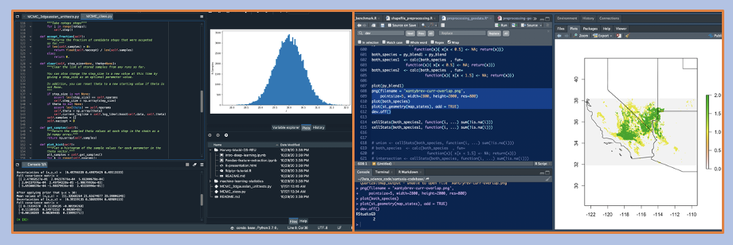

## Programming 

---

Details about my programming competencies (as of Jan 7 2021).

Table of contents: Python, R, C++, OCaml, Zsh, MATLAB, ArcGIS

---

**1. Python.** The language I have most applied experience with. ML cross-validation tuning and validation error pipelines, feature engineering, feature selection, raster-based analytics, data mining and pre-processing, data visualization, unsupervised learning, and constitutive physics modeling. Some of these programs are centrally based on recursion (e.g., feature selection), while others develop object-oriented classes (e.g., MCMC parameter space exploration). I am comfortable in writing style guide enforcement (e.g., flake8) for Python programs, and with leveraging well-developed third-party libraries (Pandas, NumPy, SciPy, SciKit-Learn, PyCaret, Apache-Spark, TensorFlow, Matplotlib, GeoPandas, SymPy, PyImpute). I am proudly an open-source contributor to PyImpute (a high-level geo-classification library), updating Sci-Kit Learn pipelines and geo-data processing in several of its functions. 

* For more detail on my Python programming, see my GitHub repos “Furman-DS-programs”, “ensemble-climate-projections”, and “Furman-and-Goldsby”.

---

**2. R.** The language I have second-to-most applied experience with. Applied Work: Mudd Data Science REU (’19-present), Australian Wet Tropics bird abundance project (’18) (applied statistics research during my semester abroad). Info: I implement R scripts for statistical modeling, data mining and pre-processing, geo-spatial statistics, random aerial sampling, alpha hull analyses in three-dimensional Principal Component space, and similarity clustering (ie. with Jaccard metric). In the Harvey-Mudd Data Science REU, I worked heavily with primarily R statistician Dr. Tanja Srebotnjak.

---

(Screenshots from my Python and R development, with my Mac's preferenced color settings.)

---

**3. C++** (as well as OCaml). Introductory exposure to topics such as object-oriented data structures, data structures, program design, value-oriented programming, lists and recursion, nested patterns, abstraction/modularity, and the transform/fold higher-order functions. Languages employed for self-study and an array of audited courses as an undergraduate at the University of Pennsylvania. These experiences inform the programming practices I use in Python and R, as well as my curiosity to learn more about software engineering and production-level code as a graduate student. 

---

**4. Zsh** & Shell scripting. I rely on the terminal for a multitude of tasks, to set up my Python programming environments, to manage my Mac’s files, and to compile code (such as C++ in the AWS Cloud9 IDE). I also rely on the terminal for management of my GitHub repositories and for pull-request collaborations. 

---

**5. MATLAB.** Employed for topics in mathematics. Info: Proficiency to write, from scratch, numerical methods in errors and floating-point numbers, solutions of equations, polynomial interpolation, calculus, approximation of functions, solutions of differential equations, solving linear systems equations, vector spaces, orthogonality and the Gram–Schmidt algorithm, determinants, eigenvalues and eigenvectors, and linear transforms, as well as run time analysis across these topics. 
 
---

**6. ArcGIS.** Cartographic modeling for a wide variety of geo-spatial analytics. Info: With coursework from the inventor of Map algebra (Dana Tomlin), I am versed in the nature and use of raster-based information. Fluency with Python source-code for ArcGIS functions, as well as with the writing code with the ArcGIS API for Python. Concepts from the course were critical in my geo-modeling research, in many of the raster-based analyses I have implemented in Python and R. 

